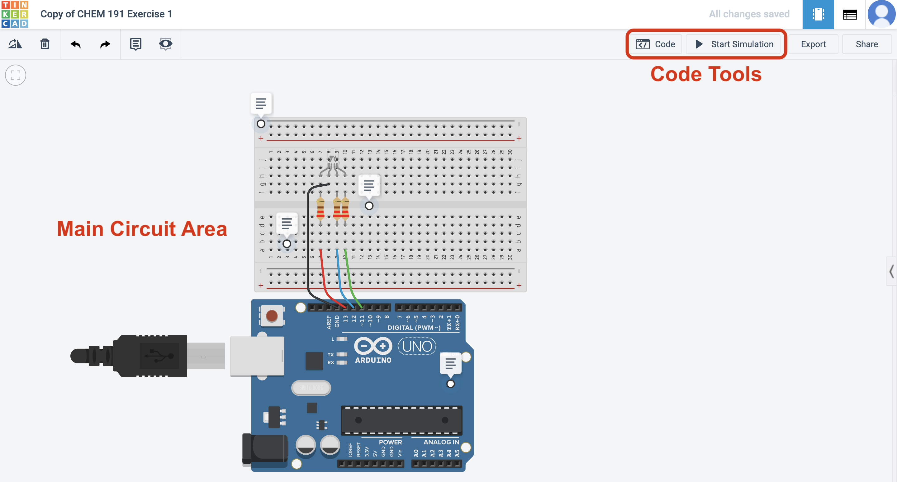

<a class="quicklink" href="https://github.com/alphonse/alphonse.github.io/raw/master/archive/chem191-f2019/pdf/tinkercad-volts.pdf" target="_blank"> Download Assignment as PDF </a>

____________________________________________________________

**Objective:** Program an Arduino on Tinkercad using the language Scratch.  
**To turn in:** I will view your Arduino/Scratch code through the Tinkercad website.  
**Grading:** This assignments counts for 10 points of extra credit toward your homework grade.  
**Filename Example:** `fischerAl_tinkercadVolts.png`  

## Introduction

In the previous exercises on Tinkercad and in class, you learned to program an Arduino to *output*  a signal to turn a light on and off.  Arduinos can also receive *inputs* -- that is, read data from other devices.  These inputs can be either *analog* or *digital*, but this exercise will focus on analog signals.  Unsurprisingly, reading an analog signal involves connecting the device to an analog input on the Arduino/Teensy, which are usually labeled A0, A1, A2, and so on.  Once the device is connected, the voltage (electrical signal) it outputs can be read by the Arduino using the command `AnalogRead(pin);`.

Reading a signal can be useful if you want to use the Arduino in a feedback loop to (for example) maintain the temperature of a room at a specific set point or log data to a file.  However, it's often more interesting if the data the Arduino reads is also displayed on the computer screen.  This is done using a feature of the IDE called the Serial Monitor.  When using the Serial Monitor, the Arduino is programmed in such a way as to write data to the computer's serial port (through the USB port).  The Serial Monitor then reads the data from the computer's serial port and displays it as text on the screen.  The Serial Monitor is useful for displaying data on the screen, but is also one of the best tools for debugging code (finding errors) as it provides a visible indicator of what the program is done and what might be going wrong.

In this exercise, you'll use Tinkercad to develop a sketch to read the voltage from a potentiometer and print the value to the serial monitor.  You will also use a *variable* to store a value.  This code will be very similar to the code you use to read the temperature in lab.

## Getting Started on Tinkercad (skip this if you've completed it previously)

1. Go to [tinkercad.com](https://www.tinkercad.com/) and click the green **Join your class** button.
1. Enter the class code (KNRMQXCFCCSU) when prompted.
1. Enter your first name in the Nickname field.  Once you log in, anything you create will be visible to your instructor for grading purposes.

## Copy a Default Circuit

1. After logging into the class, go to [https://www.tinkercad.com/things/bUvkxh7RYr8](https://www.tinkercad.com/things/bUvkxh7RYr8) and click the **Copy and Tinker** button.  The circuit used for this assignment will automatically be copied to your personal dashboard and your code will be visible to your instructor.

    > *The notes on the circuit can be expanded and will explain what each part is.*

## Program the Arduino

1. Click the **Code** button at the top right of the Tinkercad window.  The code pane will slide out. (See Figure 1, below.)

    

1. In the pane that slides out, click the **Blocks** dropdown and select **Blocks + Text**.  This will allow you to see both the Scratch code and the Arduino code (which is generated by the Scratch code automatically).  See Figure 2 for more clarification.

    

1. Click the fuchsia **Variables** option in the top left of the code pane and then click **Create variable...*.  Name your new variable sensorValue.

     > *A variable is a place to store data and will be used as a placeholder in the code for the actual data.*

1. Find the module that says `set [sensorValue] to [0]` and drag that block into the *Scratch Code* area.  Place it right under the first comment block.

1. Now, link the variable to the input read on pin 0.  Go to **Input** (purple) and choose `read analog pin [A0]`.  Drag this to where the `0` is in the `set` block. (Note the shape is the same.)

1. Connect the second comment block to the bottom of the `set` block.

1. Go to **Output** (blue) and drag `print to serial monitor [hello world] [with] newline` into your code.

1. Find the variable `sensorValue` under **Variables** and drag it into the oval in `print to serial monitor`.

## Run the Program

1. Press **Start Simulation** and then click on the **Serial Monitor** button in the bottom left of the code window. You should see number streaming across the Serial Monitor window that opens. (Remember, once the code ends the Arduino loops back to the beginning and repeats it indefinitely!)

1. Move the dial around with the mouse while the program runs.  Notice what happens to the value in the Serial Monitor.

## To Turn In:

I will consider two items when grading this: (1) a screenshot of your code submitted to Dropbox (should look like Figure 2, above but with different code) and (2) your circuit on Tinkercad.

- **To turn in your screenshot:**
  1. Use your computer's screenshot utility to take a screenshot.  On Windows you can go to the start menu and search for screenshot.  On Mac you can press **command + shift + 4** all at once; the screenshot will be automatically saved to your Desktop.
  1. Right click on your screenshot file, click **Rename**, and name your file according to: ***firstnameLastname_tinkercadVolts.png***.
  1. Go to **[alphonse.github.io/archive/chem191-f2019](https://alphonse.github.io/archive/chem191-f2019/)** and click on **Assignment Submission Links**.
  1. Find the URL for the 'Extra Credit - Tinkercad - Volts' assignment and copy/paste it into your browser.
  1. Click **Choose Files** and select the screenshot you wish to upload.
  1. Enter your first (preferred) and last names and your email address, and then press **Upload**.
  1. That's it!  You should receive a confirmation email that your assignment was submitted.

There is nothing else you need to do to turn in your circuit.  As long as you submitted your completed your circuit within the class area on Tinkercad I will be able to view it.
