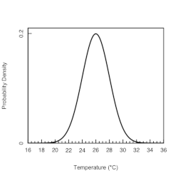
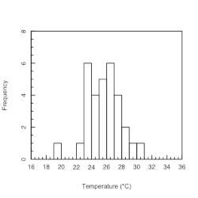

<a class="quicklink" href="https://github.com/alphonse/alphonse.github.io/raw/master/archive/chem370-f2020/pdf/assignments/week03.pdf" target="blank">Download PDF of Assignment</a>
<a class="quicklink" href="https://github.com/alphonse/alphonse.github.io/raw/master/archive/chem370-f2020/pdf/assignments/week03_key.pdf" target="blank">Download PDF of Answer Key</a>

<!-- Name: ___________________________________ -->

# Introduction

This assignment covers Chapters 3 and 4 of [*Analytical Chemistry 2.1*](https://chem.libretexts.org/Bookshelves/Analytical_Chemistry/Book%3A_Analytical_Chemistry_2.1_(Harvey)/02%3A_Basic_Tools_of_Analytical_Chemistry) by Harvey involving basic analytical chemistry terms, statistical analysis, and confidence intervals.

*You should work in groups to complete this activity.* Remember to maintain physical distance even when working in groups!  

# Types of Error

<!-- 1. To prepare a standard solution of Mn$^{2+}$, a 0.250 g sample of Mn is dissolved in 10 mL of concentrated HNO3 (measured with a graduated cylinder). The resulting solution is quantitatively transferred to a 100-mL volumetric flask and diluted to volume with distilled water. A 10-mL aliquot of the solution is pipetted into a 500-mL volumetric flask and diluted to volume.

    1. Express the concentration of Mn in mg/L, and estimate its uncertainty using a propagation of uncertainty.

    1. Can you improve the concentration’s uncertainty by using a pipet to measure the HNO3, instead of a graduated cylinder? -->

1. An analyst is diluting samples using a micropipette and mistakenly sets it to deliver 100.0 ml of solution instead of 10.00 ml of solution.  Is this a determinate or indeterminate error?  What affect will this have on $\bar{x}$ when the samples are analyzed?  What about $s$?

<!-- \vspace{1cm} -->

# Characterizing Data

> Chemists usually use the **mean** as a measure of spread.  When a mean represents a set of measurements we call it the *sample mean*, $\bar{x}$; when it represents every possible measurement, we call it the *population mean*, $\mu$.  All chemical measurements determine $\bar{x}$:
>
> $\bar{x} = \frac{\sum_{i=1}^{N} x_i}{N}$
>
> where $N$ is the number of data points, $x_i$.
>
> Chemists usually use the **standard deviation** (SD) as a measure of spread.  It has the same units as the mean.  When a SD represents a set of measurements we call it the *sample SD*, $s$; when it represents every possible measurement, we call it the *population SD*, $\sigma$.  All chemical measurements determine $s$:
>
> $s = \sqrt{\frac{\sum_{i=1}^{N} (x_i - \bar{x})^2}{N-1}}$
>
> The population is described by a *normal distribution*, a smooth function, governed by $\mu$ and $\sigma$.  Real data are shown as a *histogram*, or bins of real data that approximate a normal distribution and represent the sample statistics.

1. The normal distribution in Figure 1 represents the theoretical daily high temperatures for the month of August in Altamont.  The population mean is $\mu$ = 26$^{\circ}$C and the population standard deviation $\sigma$ = 2$^{\circ}$C.  
      
      1. What percentage of days would you expect to have a high between 24$^{\circ}$C and 28$^{\circ}$C?
      
            <!-- \vspace{1cm} -->
            
      1. What percentage of days would you expect to have a high between 28$^{\circ}$C and 32$^{\circ}$C?
            
            <!-- \vspace{1cm} -->

      <!--  -->
      

# Confidence Intervals

When comparing data, we must be certain the differences are *significant*.  Chemists use *confidence intervals* to determine significance.  If the confidence intervals do not overlap, the measurements are significantly different.

> A confidence interval is calculated at a predetermined level of certainty, for example 95% (or $\alpha$ = 0.05).  A measurement is always reported with the confidence interval:
>
> value = $\bar{x} \pm \text{CI} = \bar{x} \pm t \frac{s}{\sqrt{N}}$
>
> where $t$ comes from a $t$-table.

1. The *histogram* in Figure 2 shows the measured daily high temperatures for the month of August in Altamont for the year 2020. For this data, $\bar{x}$ = 25.6$^{\circ}$C and $s$ = 2.23$^{\circ}$C. An observation was made on every day of August.  What range of temperatures can you be 95% certain encompass $\mu$?

      <!-- \vspace{2cm} -->

      <!--  -->
      
      
1. Gacs and Ferraroli reported a new method for monitoring the concentration of SO$\_2$ in air. They compared their method to the standard method by analyzing urban air samples collected from a single location. Samples were collected by drawing air through a collection solution for 6 min. Shown here is a summary of their results with SO$\_2$ concentrations reported in $\mu$L m$^{-3}$. Using an appropriate statistical test, determine whether there is any significant difference between the standard method and the new method at  $\alpha$ = 0.05.  

| Standard Method | New Method |
|:---------------:|:----------:|
|      21.62      |   21.54    |
|      22.20      |   20.51    |
|      24.27      |   22.31    |
|      23.54      |   21.30    |
|      24.25      |   24.62    |
|      23.09      |   25.72    |
|      21.02      |   21.54    |

*The data in this problem are from Gacs, I.; Ferraroli, R.* Anal. Chim. Acta ***1992***, *269, 177–185*.

\pagebreak

# Choosing a Method

Choosing a method to analyze a particular analyte in a particular matrix is an essential skill for any analytical chemist.  There are many factors go into this decision, and often there is more than one 'correct' answer.

> When choosing a method, a chemist will consider many factors including sensitivity, selectivity, interferences, robustness, ruggedness, cost, and availability.

1. An analyst needs to evaluate the potential effect of an interferent, $I$, on the quantitative analysis for an analyte, $A$. They begin by measuring the signal for a sample in which the interferent is absent and the analyte is present with a concentration of 15 ppm, obtaining an average signal of 23.3 (arbitrary units). When they analyze a sample in which the analyte is absent and the interferent is present with a concentration of 25 ppm, they obtain an average signal of 13.7.

      1. What is the sensitivity for the analyte?

            <!-- \vspace{0.5cm} -->

      1. What is the sensitivity for the interferent?

            <!-- \vspace{0.5cm} -->

      1. What is the value of the selectivity coefficient?

            <!-- \vspace{0.5cm} -->

      1. Is the method more selective for the analyte or the interferent?
      
            <!-- \vspace{0.5cm} -->

1. Refer to NIOSH (National Institute for Occupational Safety and Health) [Method 3500](http://www.cromlab.es/Articulos/Metodos/NIOSH/NIOSH%203000/3500.pdf) to complete the following questions.

      1. What is the *analyte*?
        
          <!-- \vspace{0.5cm} -->
        
      1. What is the *technique* used?
      
          <!-- \vspace{0.5cm} -->
    
      1. What is one *interferent*?
      
          <!-- \vspace{0.5cm} -->
    
      1. What is one step/precaution described that will help avoid interferences?
      
          <!-- \vspace{0.5cm} -->
    
      1. How was the method verified?
      
          <!-- \vspace{0.5cm} -->
    
      1. Is this a method, procedure, or protocol?
      
          <!-- \vspace{0.5cm} -->
    
      1. What is the stimulus used in this experiment?
      
          <!-- \vspace{0.5cm} -->
          
<!-- \vfill -->
 
 --------------
 
*The activities here are based on, and many are reprinted directly from, Analytical Chemistry 2.1 by David Harvey.  That text, and this work, are licensed under the Creative Commons Attribution-NonCommercial-ShareAlike License [4.0](https://creativecommons.org/licenses/by-nc-sa/4.0/). Under the conditions of this copyright you are free to share this work with others, either electronically or in print. You also are free to remix or adapt the work, provided that you attribute the original work and author and that you distribute your work under the same or similar license. You may not use this work for commercial purposes.*
