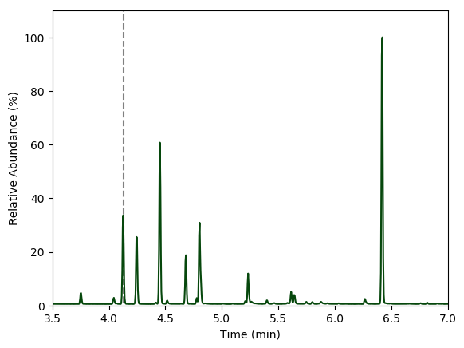
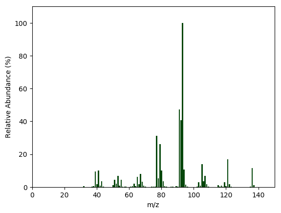
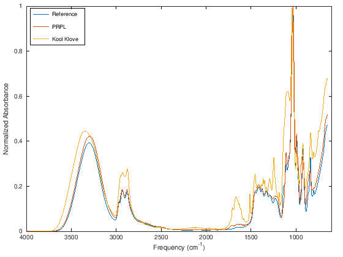

# Appendix 1: R Cookbook {-}

This appendix contains snippets of code you can use to accomplish specific tasks in R.  For the most part, you can copy and past this code and change the variable names to perform the tasks listed.  Most of the programming tasks you'll need to accomplish in Chem 370 can be found here.

Some of the code is in the form of *functions*.  The code for each function should be run once in your notebook, after which point you can use that function just like any built-in R function.

Any code preceded by a `#` is a comment and is not interpreted by R.

## Chromatogram & Mass Spectrum Plotting {-}

Chromatograms and mass spectra are often normalized to the maximum value in the chromatogram to give a $y$-axis in *Relative Abundance*, either as a fraction (0-1) or percentage (0-100%).  The following example assumes a data frame with *Time* as column 1 and *Detector Signal* as column 2.

```{r, eval = FALSE}
### add a new column (3) that is the detector signal divided by the maximum detector signal.
chromatogram[:, 3] = chromatogram[:, 2] / max(chromatogram[:, 2]) * 100;
```

For chromatograms, it may sometimes be desirable to baseline correct the data first, as in:  

```{r, eval = FALSE}
### add a new column (3) that is baseline corrected
chromatogram[:, 3] = chromatogram[:, 2] - min(chromatogram[:, 2])
### normalize the baseline-corrected data and convert to percentage
chromatogram[:, 3] = chromatogram[:, 3] / max(chromatogram[:, 3]) * 100
```

For mass spectra, data are mostly commonly plotted as bar plots instead of line plots.  This is because the the ions effectively have discrete, integer masses.  The example below assumes you have a data matrix called `massSpectrum` with $m/z$ in column 1 and detector signal in column 2.

```{r, eval = FALSE}
### convert to relative abundance
massSpectrum = massSpectrum[:, 3] / max(massSpectrum[:, 3]) * 100

### plot as bar plot
bar(massSpectrum[:, 1], massSpectrum[:, 3])
```





## Import Data from CSV {-}

Reads data from CSV file.  Must be comma delimited.

**Example:**  

```{r, eval=FALSE}
X <- csv.read('filename.csv')
```

## Find Peak Area {-}

Returns area under curve (integrates peak) for 2-column matrix `C` from limits `x1` to `x2`.

**Form:**

`peakArea(C, x1, x2, p = true)`

**Example:**  

`A = peakArea([chromatogram[:, "TIME COLUMN"], chromatogram[:, "Signal Column"], 1.7, 2.05)`

finds the area of chromatogram from 1.7 to 2.05 time units and plots the result.


## Fit Linear Model (Calibration) {-}

Returns slope, intercept, $R^2$, and line of best fit data of best fit line given a data frame containing $x$ (usually concentration) and $y$ (signal) data.

```{r eval=FALSE}
calcurve = lm(y ~ x, data = calData)
```
## IR Spectrum Processing {-}

IR spectra will be collected as *Absorbance* vs. *Frequency (in wavenumbers)*.   You will use this to calculate the hit-quality index (HQI) of each spectrum compared to a reference sample.  Read [Rodriguez et al 2011](https://www.researchgate.net/publication/51602215_Standardization_of_Raman_spectra_for_transfer_of_spectral_libraries_across_different_instruments) for more information on HQI.

The examples below assume `X` is defined as a spectrum containing *wavenumber* as the first column and *absorbance* and the second column.

### Pre-processing {-}

Often, IR spectra are normalized for comparison to each other.  This is done by baseline correcting the spectra so that the minimum value is zero (i.e. subtracting the minimum value in the spectrum) and setting the maximum value of each spectrum to 1 (i.e. dividing by the maximum value).  This approach is shown below.  An alternative approach is *mean centering*, which is not shown here.

You should show your normalized data when comparing spectra in your lab notebooks or reports (at least for Chem 370 lab).

**Baseline the data:**

```{r, eval=FALSE}
X[:, 3] <- X[:, 2] - min(X[:, 2])  # subtract minimum abs. from all abs. values a new column
### Do this for all 3 of your spectra
```

**Normalize the data to 1:**

```{r, eval=FALSE}
X[:, 3] <- X[:, 3] / max(X[:, 3])  # divide all baselined abs. values by max abs. value
### Do this for all 3 of your spectra
```

**Take the mean of 3 spectra:**

```{r, eval=FALSE}
### Put your three spectra in a 3-column matrix
sample_A <- data.frame(X[:, 2], X_2(:,2), X_3[:, 2])

### Then, take the mean across rows
sample_A <- rowMeans(sample_A) 

### Do this for both samples and the reference
```

### Hit-quality Index Calculation {-}

The hit-quality index is defined as:

$$
HQI = \frac{(\text{Reference} \cdot \text{Sample})^2}{(\text{Reference} \cdot \text{Reference}) \times (\text{Sample} \cdot \text{Sample})}
$$

Note that the dot is the *dot product*, NOT multiplication!  The dot product is easily calculated in Octave with the `dot()` function.  The example below assumes you have created a matrix with the normalize absorbance in column 3 as per the examples above.

```{r, eval=FALSE}
dot(Ref[:, 3], X[:, 3])^2 / (dot(Ref[:, 3], Ref[:, 3]) * dot(X[:, 3], X[:, 3]))
### do this for both samples
```

This produces a single value that should be less than 1.  If your answer does not meet these criteria try the calculation again.

### Plotting IR Spectra {-}

You should always plot your normalized data when comparing spectra in your lab notebooks or reports (at least for Chem 370 lab).

Note that (according to IUPAC convention) spectra are always plotted with higher energy on the left and lower energy on the right side of the $x$-axis.  For IR spectra displayed with frequency as $x$, this means you have to reverse the axis to be in reverse order, such that it go from higher frequency (higher energy, smaller wavelength) to lower frequency (lower energy, longer wavelength).

```{r, eval=FALSE}
plot(
  X[:, 1], sample_A, 
  xlim = c(4000, 600), ylim = c(0, 1)
  xlab = "Frequency (cm^-1)", ylab = "Normalized Absorbance"
)
lines(X_2[:, 1], sample_B)
lines(Ref[:, 1], Ref[:, 3])

### Make sure you include a legend too!
```



## Serial Dilution {-}

Returns standard concentrations based on serial dilutions of a stock solution.

**Form:**

`serialDilution(stock, pipettes, flasks)`

**Example:**  

`serialDilution(100.2, [5 10 10], [50 50 50]);`

**Arguments:**  

- `stock`: a scalar indicating the concentration of the stock solution.

- `pipettes`: a column vector containing the volumes of the pipettes used (in order).  Volume units should match `flasks`.

- `flasks`: a column vector containing the volumes of the volumetric flasks used (in same order as `pipettes`).  Volume units should match `pipettes`.

**Code:**
```{octave eval = FALSE}
function concentrations = serialDilution(stock, pipettes, flasks)
    concentrations =[];
    for i = 1:length(pipettes)
        if i == 1
            concentrations(i) = stock * pipettes(i)/flasks(i);  # calculate first dilution
        else
            concentrations(i) = concentrations(i-1) * pipettes(i)/flasks(i); # calculate all other dilutions
        end
    end
    concentrations = flip(concentrations)'; # reverse the vector from lowest to highest and transpose to column vector
end
```
