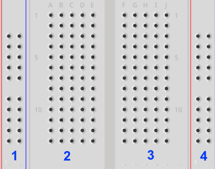

# Chem 191 | Blink Worksheet

## Name:

  \vspace{0.5cm}

____________________________________________________________
**Instructions:** Complete this worksheet along with Exercise 1 in the Teensy Workbook.  
**Grading:** This assignments counts for 25 points toward your lab grade.  
**Submitting:** Before you leave today, turn in a hardcopy of this assignment to your instructor and an electronic copy of your Arduino code to Dropbox with the "Exercise 2 - Blink - Code" Link.    
**Filename Example:** `seriousUmbrellas_blink.ino`  
 ____________________________________________________________

  \vspace{0.5cm}

1. Draw lines on the breadboard below to show how the pins are connected internally.  Show at least two lines  for each of the 4 sections.


    { width=1.5in }


2. In your own words, describe what a *sketch* is as it relates to programming.

  \vspace{5cm}


3. Write what each line does in the code below.  Write your answers at the end of each line.

    ```Cpp
    void(loop) {
      digitalWrite(led, HIGH);
      delay(2000);
      digitalWrite(led, LOW);
      delay(5000);
    }
    ```

4. Each group should submit a copy of their *Blink* code to Dropbox.  Make sure it's titled according to the format ***groupname_blink.ino*** or you'll get points deducted!
