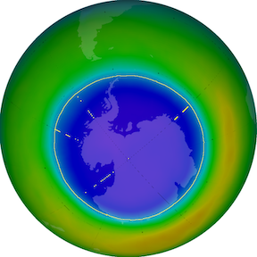

<a class="quicklink" href="#intro">Introduction</a>
<a class="quicklink" href="#methods">Methods</a>
<a class="quicklink" href="#results">Results and Discussion</a>
<a class="quicklink" href="#conclusion">Conclusion</a>
<a class="quicklink" href="#references">References</a>
<a class="quicklink" href="#supplemental">Supplemental Info</a>

# Useful Links on Writing

***FINAL REPORT TEMPLATE:*** [Download Word Doc](https://github.com/alphonse/alphonse.github.io/raw/master/archive/chem191-f2019/assignments/final-paper-template.docx)

### Class Standards
- Dr. Fischer's [Writing Guide]({{ site.url }}/archive/chem191-f2019/guides/writing)
- Dr. Fischer's [Report Rubric](https://github.com/alphonse/alphonse.github.io/raw/master/archive/chem191-f2019/pdf/lab-report-rubric.pdf) (PDF)
- [SPIE: How to Write a Good Scientific Paper](https://doi.org/10.1117/3.2317707)

### Style and Language
- *Elements of Style for Writing Scientific Journal Articles*, Stephen M Griffies, William A. Perrie, and Gaëlle Hull, free PDF [here](http://www.climatescience.org.au/sites/default/files/Elements_of_Style_for_journal_articles_A4_29Nov.pdf).
- *Elements of Style*, William Strunk, Jr. (aka "Strunk and White") free html & ebook at [Project Gutenberg](http://www.gutenberg.org/ebooks/37134?msg=welcome_stranger) or free PDF [here](http://www.jlakes.org/ch/web/The-elements-of-style.pdf).
- [IEEE Style Guide](https://www.tec.ac.cr/sites/default/files/media/doc/style_manual.pdf)

### Reference Manager
- [Mendeley Info]({{ site.url }}/archive/chem191-f2019/guides/mendeley)

# Class Data

- Data for the project is available here: [https://github.com/dr-fischer/WheeCAIR](https://github.com/dr-fischer/WheeCAIR)  
	1. Go to the link above.
	2. Click the **Clone or Download** button.
	3. Choose **Download ZIP**.
	4. Extract/unzip the file to a location on your computer.
	5. Browse to the `data` folder for the data.  You will then see folders for several locations.  You will need data from `grsm-purchase/2019` (Purchase Knob) and `mack/2019` (Dillsboro, NC).  You will also need the NOAA weather station data in `grsm-purchase/2019/weather_noaa` directory.  ***Make sure you use the 10 minute average (10minAvg) versions of the data!***

<a id="intro"/>

# Writing an Introduction

The introduction to the paper serves to orient the reader to the topic at hand and provide an *very brief* overview of the study at hand.  If you've written a research paper or 5-paragraph essay for a class before, the introduction is much the same.  You can think of it as a 5-paragraph essay that makes up the first section of your paper (but don't necessarily limit yourself to the 5-paragraph format).  Of course, this means you will have to do research to write the intro!  It should convey what questions the study is asking, why it's asking those question, and what led the author's to ask those questions.  It should also discuss any similar work that's been done previously and describe how the author's work relates to the previous studies.  Provide context by citing relevant *scholarly* sources.  There is no specific formula for what to include -- the intro is your chance to decide what you think is important for the reader to know.

> The Introduction section should answer two questions: “What?” and “So what?” What is the paper about, and why should the reader care? [1]

- Read *How to Write a Scientific Paper* by Chris Mack, section 2.2 for guidance. [1]
- Look at [2] as an example of a good introduction.
- Look at the introduction of [3] as another example (i.e. section I).  Remember the pluses and minuses we talked about in class regarding this introduction.  Try to avoid the minuses and repeat the pluses!

**Style tips:**  

  - Write in *present tense*.
  - Use active voice (first-person is OK, too).

<a id="methods"/>

# Writing a Methods Section

The methods section provides the reader of your manuscript a *detailed* account of how you completed your study.  It should contain enough information that the reader could complete your study with no other resources.  However, it should *not* contain extraneous details or irrelevant minutia.  More information about what constitutes appropriate detail is provided in Mack (2018). [1]

> There are really two interrelated goals at work: the reader should be given the ability to reproduce the results and the ability to judge the results. [1]

For this assignment, you should turn in a methods section to your final paper that details your sensor construction and deployment.  

**Style tips:**  

  - Write in *past tense*.
  - Use active voice (first-person is OK, too).
  - All tables must have a title *above* the table and be numbered sequentially.
  - All figures (images or graphs) must have a caption (that includes a title and brief description of the figure) *below* the figure and be numbered sequentially.

  **Examples:**

  **Table 1: A table with a lot of useful information**  

  | Column 1      | Column 2       |
  | ------------- | -------------- |
  | a bit of info | some more info |

  
  *Figure 1:* An example figure showing the Antarctic ozone hole.  High ozone concentrations are shown in orange/red and low ozone concentrations are shown in purple.

## Specific Instructions for Methods

Your document should have the following sections:

**II. Materials and Methods**

*A. Hardware Components*

  - Include a table specifying the key components used (some of this information is in Table 1, below, but you will need to add info about the Teensy 3.5)
  - Include a *block diagram* showing how the components are connected together (See Fig. 1 in [3] as an example)
  - Include a photo of your sensor (you can include a place holder for now if you don't have a photo, see Fig 2 in [3] or p. 28 in [2]).

  Each of these figures should be explicitly referred to in the text, in order.  This means you will also have to supply text discussing each figure in detail.

  This section should also provide a description of what was done to weatherproof the sensors and a description of how the sensor was assembled (you will be given a bill of materials to use as an appendix)

  Refer to Table 1 below for a review of the sensors used and measurements conducted.

*B. Site Description*  

  - Include the name a location of the site where you deployed your sensor.
  - Include GPS coordinates of the site (use UTM format - [Lat/Long to UTM conversion tool](http://www.rcn.montana.edu/resources/converter.aspx)).
  - Include the elevation of the site (in meters).
  - Include any additional information about the site that might be important.
  - Include information about the study as a whole, not just your sensor.  How many sensors were deployed in total?  Were there any additional instruments at the sampling site?
  - Include the approximate height above the ground at which you mounted your sensor.
  - You will use a sensor from Dillsboro as a comparison.  Include the description of *Site B* (below) in your report and list your site as *Site A*.  It's OK to copy this description exactly as it is below.  

  **Example site description:**

  *Site B:* One sensor was deployed near Dillsboro, North Carolina, United States at an elevation of 770 m (17S 293055 3914390).  Dillsboro is a small town near the Great Smoky Mountains of North Carolina and can be classified as a rural site.  The sampling site is in a small grassy clearing between forest and a gravel road.  Moreover, the site is in a cove with a rock quarry and asphalt plant, along with many residential wood fireplaces.  The sensor was mounted 1 m from the ground on a metal pole.  This site was chosen as a rural site with heavy anthropogenic influence.

*C. Sampling Routine, Data Processing, and Data Storage*

  - Include how often a data point was collected.  Remember, the sensors slept for 10 minutes, then woke for 30 seconds to get a measurement.
  - Include how the data was stored on the sensor.  Remember, the sensor writes a raw text file to the SD card.
  - Include how the data were processed.  (We'll use Excel -- you can leave this section blank for now since we haven't done it yet.)
  - Include where the data are stored.  Use the following text: Data are available for download at https://github.com/alphonse/grsm-sensors.

**Table 1: Sensors Used**  

| Measurement                     | Sensor                  |
| ------------------------------- | ----------------------- |
| Particulate Matter (PM$_{2.5}$) | Honeywell HPMA115S0-XXX |
| Volatile Organic Carbon (VOC)   | Bosch BME-680           |
| Temperature                     | Bosch BME-680           |
| Relative Humidity               | Bosch BME-680           |
| Pressure                        | Bosch BME-680           |

<a id="results"/>

# Results and Discussion

The *Results and Discussion* section serves two purposes: (1) to present the results (data) and (2) to put those results into context with a thoughtful discussion about whether the results were anticipated, how they compare to previous work, and how they can be explained using models, theories, general knowledge, and reasoning.  Note that the results section should be a *logical argument* based on evidence, not a chronological description of the experiment.

> Evidence does not explain itself. The purpose of the Discussion section is to explain the results and show how they help to answer the research questions posed in the introduction. This discussion generally passes through the stages of
summarizing the results, discussing whether results are expected or unexpected, comparing these results to previous work, interpreting and explaining the results (often by comparison to a theory or model), and hypothesizing about their generality. [1]

You *must* present results supporting every conclusion you draw; likewise, you must use sound logic when interpreting the results to draw conclusions.  Similarly you *must not* withhold results that don't support your hypothesis or conclusions; all results must be reconciled, whether they agree or not.

Style tips (see the [writing guide](https://alphonse.github.io/archive/chem191-f2019/guides/writing) for more info):
	- Write in paste tense.
	- Be specific.
	- Avoid faulty and incomplete comparisons.

Please see [1] for more information and [2] (section 3 "Results and Discussion") as an example of a results and discussion section.  Ref [3], section V "Experimental Analysis" also provides an example of a results and discussion section.

### Data Processing

1. Look for any errors in your data:
	- Do the values seem correct?  If not, can you explain why?  
	- Is the timestamp correct?  If not, you should fix it based on the start time from your deployment sheet.
	- Are the values zero or missing?  If so, can you explain the missing data?

	*Note that there is a distinct difference between correcting errors (e.g. an incorrectly set clock) and "correcting" (making up) data; the first is necessary, the second is unethical.*

1. Most data can be used as-is.  However, the pressure is measured and reported barometric pressure and must be converted to mean sea-level pressure for comparison to other data.  Refer to this [PDF document](https://www.sandhurstweather.org.uk/barometric.pdf) for details on how to do this.

### Figures

Include, at minimum, the following:

1. Plot *Temperature vs. Time*, *Relative Humidity vs. Time*, *Pressure vs. Time* (processed per instructions above), *VOC vs. Time*, and *PM vs. Time* on separate plots.  
1. For Temperature, RH, and Pressure, you should include (1) your data, (2) data from another group's sensor, (3) data from Dillsboro, and (4) data from the NOAA weather station on each plot.  For VOC and PM you should include (1) data from your sensor, (2) data from another group's sensor, and (3) data from the Dillsboro sensor.  Make sure to include a legend on your plot.

Remember to label your axes (and include units) and provide a caption below each figure with a number for each figure.  Provide a summary of each figure in the main text, and refer to each figure by number where it's discussed; figures should appear/be numbered in the order in which they are discussed.  When discussing each figure, provide not only a summary of the figure but also your *interpretation* of the data.  Put the data in context.  How do the data relate to other data or typical trends?  Do your data agree with the NOAA ("gold-standard") sensors?  Do the data from Purchase Knob and Dillsboro agree?  Are the results expected and easily explained by common knowledge/theories, or are they unexpected?  You do not have to specifically answer all these questions, but they should provide a starting point to help you think about *discussing* the data (it is the *Results and Discussion* section, after all!).  

<a id="conclusion"/>

# Conclusion

The conclusion should provide a brief summary of the results, highlighting the key breakthroughs or findings.  It should specifically relate the conclusions back to the research questions posed in the introduction and explain their significance.  Finally, it should provide recommendations for future improvements or expansions upon the study.  It should not just repeat other portions of the paper.

> The Conclusions section should allow for opportunistic reading. When writing this section, imagine a reader who reads the introduction, skims through the figures, then jumps to the conclusion. The conclusion should concisely provide the key message(s) the author wishes to convey. [1]

<a id="references"/>

# References

Your references should be cited in IEEE format.  You should only cite *scholarly* sources.  Points may be deducted for sources that do not meet the guidelines outlined in the Scholarly Sources workshop in the library.  Please refer to this [flowchart](https://www.library.illinois.edu/ugl/howdoi/scholarly/) to determine if your source counts as scholarly.  If in doubt, it's probably *not* scholarly.

<a id="supplemental"/>

# Supplemental Information and Appendices

You should include the following table as supplemental information.  You can reference this table in your methods section as the bill of materials for the sensor.

**Table S.1: Bill of Materials for Sensor**  

| Item                                      | PN                     | Price   | Qty | Supplier |
| ----------------------------------------- | ---------------------- | ------- | --- | -------- |
| Sensor, BME 680                           | 1597-1653-ND           | $20.910 | 1   | digikey  |
| Sensor, PM, Honeywell                     | 785-HPMA115SO-XXX      | $26.340 | 1   | mouser   |
| Micro SD                                  | SDSDQM-B35A            | $4.500  | 1   | Amazon   |
| Teensy 3.5                                | 1568-1443-ND           | $26.250 | 1   | digikey  |
| USB Cable                                 | WM25438-ND             | $3.710  | 1   | digikey  |
| Case                                      | Lowes                  | $7.150  | 1   | Lowes    |
| Case Port                                 | Lowes                  | $1.690  | 0.5 | Lowes    |
| Breadboard                                | 1738-1326-ND           | $2.990  | 1   | digikey  |
| Wire, Hookup, Assortment, 10x25'          | 485-3174               | $29.950 | 0.1 | mouser   |
| Pin headers, Breakaway, 36 position, 0.1" | WM50014-36-ND          | $0.901  | 2   | digikey  |
| LED, RGB                                  | 1830-1014-ND           | $0.829  | 1   | digikey  |
| Resistor, 220 ohm                         | CF12JT220RCT-ND        | $0.072  | 1   | digikey  |
| Thermistor                                | BC2301-ND              | $0.660  | 1   | digikey  |
| Resistor, 1k                              | S1KQTR-ND              | $0.004  | 1   | digikey  |
| Capacitor, Electrolytic, 1000uF           | P19639TB-ND            | $0.310  | 1   | digikey  |
| Relay                                     | TLP222AF-ND            | $1.013  | 1   | digikey  |
| Header, 5 Position, 0.1                   | S6103-ND               | $0.443  | 1   | digikey  |
| Header, 24 Position, 0.1                  | S7022-ND               | $1.244  | 2   | digikey  |
| Retainer, Coin Cell, 12 MM, SMD           | 36-3000CT-ND           | $0.767  | 1   | digikey  |
| Terminal, 4 Position, 3.5 mm              | WM7860-ND              | $1.121  | 2   | digikey  |
| Terminal, 2 Position, 3.5 mm              | WM7877-ND              | $0.718  | 1   | digikey  |
| Batteries, AA, Duracell Procell, 2900 mAh | PC1500BKD              | $0.520  | 6   | Grainger |
| Batteries, Coin Cell, CR1220              | P033-ND                | $0.828  | 1   | digikey  |
| Wire, PicoBlade, Pre-crimped, black       | 0500798000-10-B8-ND    | $0.676  | 1   | digikey  |
| Wire, PicoBlade, Pre-crimped, yellow      | 0500798000-10-Y8-ND    | $0.676  | 1   | digikey  |
| Wire, PicoBlade, Pre-crimped, red         | 0500798000-10-R8-ND    | $0.676  | 1   | digikey  |
| Wire, PicoBlade, Pre-crimped, violet      | 0500798000-10-V8-ND    | $0.676  | 1   | digikey  |
| PCB, Custom                               | WheeCAir v1.0 (custom) | $6.820  | 1   | OSH Park |

# Further Reading

[1] Mack, Chris A., *How to Write a Scientific Paper*. SPIE, 2018. doi: [10.1117/3.2317707](https://doi.org/10.1117/3.2317707)

[2] Ardon-Dryer, Karin, Y Dryer, J.N. Williams, and N. Moghimi, "Measurements of PM$_{2.5}$ with PurpleAir under atmospheric conditions," *Atmospheric Measurement Techniques (Discussions)* (in review)
doi:[10.5194/amt-2019-396](https://doi.org/10.5194/amt-2019-396).

[3] Guisto, Edoardo, R Ferrero, F. Gandino, B. Montrucchio, M. Rebaudengo, and M. Zhang, "Particulate matter monitoring in mixed indoor/outdoor industrial applications: a case study," *Proceedings: 2018 IEEE 23rd International Conference on Emerging Technologies and Factory Automation, Sept. 4-7 2018, Turin, Italy.* doi: [10.1109/ETFA.2018.8502644](http://tinyurl.com/rt7vtvs).
