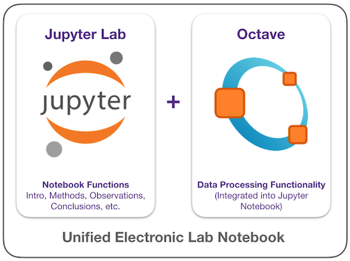

# Appendix 1: Getting Started in Octave and Jupyter Lab {-}

Chem 370 lab will make extensive use of electronic lab notebooks.  We'll use two tools to achieve a robust electronic lab notebook: (1) **Jupyter Notebooks** and (2) the **GNU Octave programming language**.  The Jupyter notebook provides a place to write everything that would normally go in your lab notebook, but is entirely electronic.  The Octave language is used to process data in a fashion similar to Excel, except that all actions are done by issuing commands rather than through a graphical interface.  Importantly, Octave can be linked to Jupyter so that all of your data processing steps and data files can be displayed directly in your lab notebook!  A visual representation of this is shown in the figure below.  You can also view the [notebook examples](../notebooks/index.html) to see what a notebook actually looks like.



You several options for creating your notebooks: (1) You may install Jupyter and Octave directly on your personal computer (recommended), use (2) Jupyter and Octave through WCU's VCAT interface, or (3) use MATLAB Live Notebooks through WCU's VCAT interface.  The information in this Appendix is meant to help you install Jupyter and Octave on your own computer and get started using it, and has information about starting the Jupyter in VCAT, too.

This Appendix will occasionally provide screen captures of the instructions being performed; the operating system used may differ from yours, but the overall steps should be similar.

## Installing the Software {-}

The section will walk you through the two steps to installing the software used for Chem 370 Lab: (1) Installing Jupyter Lab, the notebook interface, and (2) installing Octave, the data processing software that links to Jupyter.

### Install Jupyter {-}

1. Download and install the appropriate [Anaconda](https://www.anaconda.com/distribution/) distribution for your operating system (Python 3.7 version).  This installs Anaconda, Python, and Jupyter.
1. Open a command-line interface:

    - *Windows:* Search for `anaconda prompt` and open the **Anaconda Powershell Prompt** using the Windows search functionality.
    - *Mac/Linux:* Open a Terminal Window (Mac: `CMD` + `Space` then search `Terminal` and open **Terminal.app**).

3. Type `conda install -c conda-forge jupyterlab` and follow any prompts that come up to install Jupyter lab.

### Install Octave {-}

1. Download and install the GNU Octave distribution appropriate for your operating system.

    - *Windows:* Download the correct Windows installer [here](https://www.gnu.org/software/octave/#install).
    - *Mac:* Install [Homebrew](https://brew.sh/):

        `/usr/bin/ruby -e "$(curl -fsSL https://raw.githubusercontent.com/Homebrew/install/master/install)"`

        then run

        `brew install octave`.
    <!-- - *Mac:* Download the installer [here](https://octave-app.org/Download.html). -->
    - *Linux (Ubuntu):* Run `apt install octave` as `sudo`.

    <!-- conda config --add channels conda-forge -->

1. Open a command-line interface (as above) and issue the following commands to link Octave to Jupyter Lab:

    ```{bash, eval = FALSE}
    conda install -c conda-forge octave_kernel
    ```

1. *Windows Only:* Search for the `kernel.json` file and open it with Notepad.  ***Make sure it it's the `kernel.json` file in the Octave folder and not the Python folder!***  Make sure the file contains all of the lines below; if it doesn't, add them in.

    ```{marginfigure}
    If searching doesn't reveal the file you can find it manually at `C://Users/[your user name]/Anaconda3/share/jupyter/kernels/octave`.
    ```

    ```
    {
      "argv": ["python",
               "-m", "octave_kernel",
               "-f", "{connection_file}"],
      "display_name": "Octave",
      "mimetype": "text/x-octave",
      "language": "octave",
      "name": "octave",
      "env": {
        "OCTAVE_EXECUTABLE": "C:\\Octave\\Octave-5.1.0.0\\mingw64\\bin\\octave-cli.exe"
      }
    }
    ```

1. If you can't get Octave to work after the above steps, try clicking the text in the lower left corner of Jupyter that says **Octave | ______** and then select the Octave kernel from the menu.  If it's still not working after that you may need to restart your computer.

## Test the Software (Starting Jupyter Lab) {-}

### Option 1: Windows {-}

1. Click the **magnifying glass** in the bottom left corner of the screen.
1. Search for `anaconda prompt`.
1. Open the **Anaconda Powershell Prompt** that appears in the search results.
1. Type `jupyter-lab` into the prompt and press enter.  A web browser should open with a Jupyter window.
1. Create a new folder called `lab-notebooks`, and then create a subfolder called `test`.
1. Open the `test` folder you just created and click the Octave icon to create a new Octave notebook.  Name it `test`.
1. Enter the following in the cell of the new notebook:

  ```{octave, eval = FALSE}
  x = [1 2 3];
  y = [4 5 6];
  plot(x, y)
  ```

  If you see an x-y plot appear your installation is working correctly and you don't need to do anything else! If not, please inform your instructor.

<!-- ##### See it on [video](https://www.youtube.com/embed/_yjodxT0ud4?start=15) {-}

<center>
<iframe width="560" height="315" src="https://www.youtube.com/embed/_yjodxT0ud4?start=15" frameborder="0" allow="accelerometer; autoplay; encrypted-media; gyroscope; picture-in-picture" allowfullscreen></iframe>
</center> -->


### Option 2: Mac OSX / Linux {-}

1. Open a terminal application (Mac: `CMD` + `Space` then search `Terminal` and open
**Terminal.app**).
1. Type `jupyter lab` into the terminal prompt and press enter.  A web browser should open with a Jupyter window.
1. Create a new folder called `lab-notebooks`, and then create a subfolder called `test`.
1. Open the `test` folder you just created and click the Octave icon to create a new Octave notebook.  Name it `test`.
1. Enter the following in the cell of the new notebook:

  ```{octave, eval = FALSE}
  x = [1 2 3];
  y = [4 5 6];
  plot(x, y)
  ```

  If you see an x-y plot appear your installation is working correctly and you don't need to do anything else! If not, please inform your instructor.

### Option 3: Using VCAT {-}

Jupyter Lab and Octave are installed on WCU's STEM virtual machine (STEM VCAT).  You may use this as an option if you have trouble installing Octave and/or Jupyter on your own computer.  Note, however, that this option will only work when you have internet access and can slower and more difficult than running the software on your own computer.

##### Logon to VCAT {-}

1. Logon to [my.wcu.edu](https://my.wcu.edu).
2. Click [Virtual Apps (VCAT)](https://vcat.wcu.edu/catalog-portal/ui?isOnPremise=true&isMobile=false&userId=33352#/bookmarks) under the *Quick Links* section of my.wcu.edu.
3. Hover over the **STEM Specialized** option and click the **three dots** that appear in the upper right corner.  Choose **Open in Client**.

    > You will need to install the VM Ware Horizon Client if you have not already done so (you must also keep the client up to date for it to work properly).  Please visit Technology Commons if you have trouble installing or using the client.

##### Start Jupyter {-}

1. Click the **magnifying glass** in the bottom left corner of the screen.
1. Search for `anaconda prompt`.
1. Open the **Anaconda Powershell Prompt** that appears in the search results.
1. Type `jupyter-lab` into the prompt and press enter.  A web browser should open with a Jupyter window.
1. Create a new folder called `lab-notebooks`, and then create a subfolder called `test`.
1. Open the `test` folder you just created and click the Octave icon to create a new Octave notebook.  Name it `test`.
1. Enter the following in the cell of the new notebook:

  ```{octave, eval = FALSE}
  x = [1 2 3];
  y = [4 5 6];
  plot(x, y)
  ```

  If you see an x-y plot appear your installation is working correctly and you don't need to do anything else! If not, please inform your instructor.

<!-- ##### See it on [video](https://www.youtube.com/embed/_yjodxT0ud4) {-}

<center>
<iframe width="560" height="315" src="https://www.youtube.com/embed/_yjodxT0ud4" frameborder="0" allow="accelerometer; autoplay; encrypted-media; gyroscope; picture-in-picture" allowfullscreen></iframe>
</center> -->
